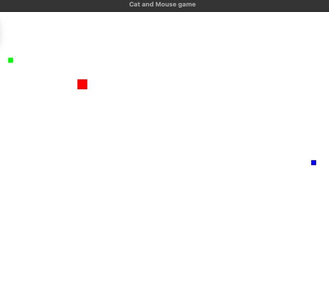

# Mouse and Cat in a Smalltalk Game 
> Fortgeschrittene objektorientierte Programmierung 2024S
>
> Second Programming Task



## Foop V

> ### &#127942; [_Dudina Anastasiia_](https://tuwel.tuwien.ac.at/user/view.php?id=182690&course=63218/)
>
> ### &#127942; [_Peura Johan Niklas_](https://tuwel.tuwien.ac.at/user/view.php?id=78904&course=63218/)
>
> ### &#127942; [_Ramírez Mejía Lorenzo_](https://tuwel.tuwien.ac.at/user/view.php?id=107014&course=63218/)

We used [Pharo](https://pharo.org) to develop the application.

**Note:** The repository must have this name on your disk.

1. Install [Pharo Launcher](https://pharo.org/download)
2. Open the launcher and go to New -> Pharo 11.0 and in Initialization script
add a new one(click on the pen and then plus) and enter:
```smalltalk
[ Metacello new
    baseline: 'Bloc';
    repository: 'github://pharo-graphics/Bloc:master/src';
    load ]
```
3. Select the initialization script and click Create Image
4. Select the created image 
5. Go to Browse -> Git Repository Browser -> Add -> Import from existing clone and select this repository
6. In the repository window select "CatMe_SmallTalk" and on all items in that 
repository select Right click -> Load
7. You can now close all windows
8. Go to Browse -> Playground and enter:
```smalltalk
GameWindow new.
```