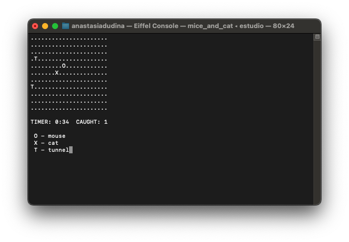

# Mouse and Cat in an Eiffel Game 
> Fortgeschrittene objektorientierte Programmierung 2024S
>
> Third Programming Task

## It is necessary to install:
> 
> XQuartz
>
> MacPorts
>
> EiffelStudio

## Foop V

> ### &#127942; [_Dudina Anastasiia_](https://tuwel.tuwien.ac.at/user/view.php?id=182690&course=63218/)
>
> ### &#127942; [_Peura Johan Niklas_](https://tuwel.tuwien.ac.at/user/view.php?id=78904&course=63218/)
>
> ### &#127942; [_Ramírez Mejía Lorenzo_](https://tuwel.tuwien.ac.at/user/view.php?id=107014&course=63218/)

